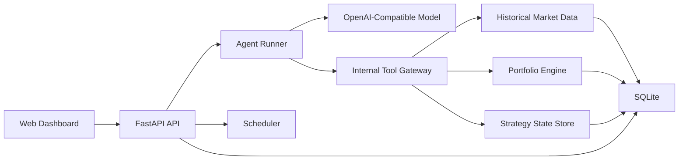
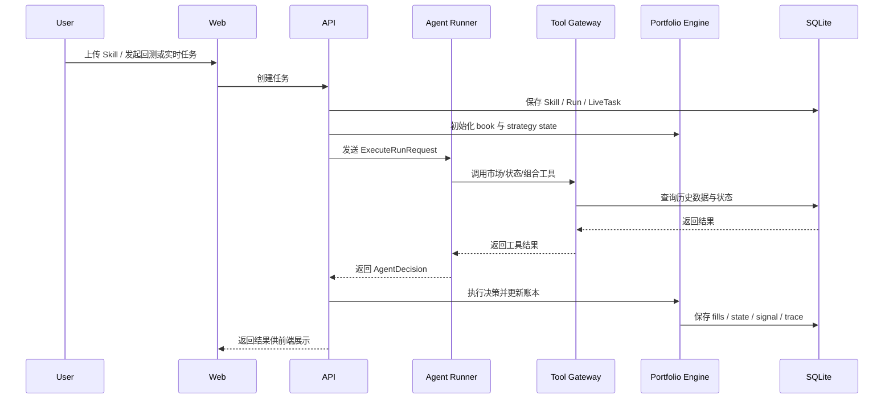

# TradeSkills 技术架构说明

本文面向技术同学，基于当前代码实现说明 TradeSkills 的系统边界、核心组件、运行流程、工具体系和关键设计取舍。

## 1. 一句话定义

TradeSkills 当前是一个“自然语言 Skill 驱动的交易执行 Runtime”：

- 用户上传一份 Markdown Skill
- 系统抽取出结构化的 Skill Envelope
- 同一份 Skill 可以在 `backtest` 和 `live_signal` 两种执行上下文中被调用
- Agent Runner 负责调用模型和工具做决策
- API 侧负责编排、状态管理、组合模拟和结果落库

它当前更接近：

- `单 Agent Runtime + Tool Gateway + 组合账本 + 回测/实时两种触发模式`

而不是：

- 多角色协作的 Multi-Agent 系统
- 真实交易所直连执行系统
- 带独立任务队列和分布式 worker 的生产级量化平台

## 2. 架构总览

如果用职责来拆，可以理解为 5 层：

1. 展示层：Web Dashboard
2. 编排层：API
3. 决策层：Agent Runner
4. 能力层：Tool Gateway
5. 状态与数据层：SQLite + 组合账本 + 历史行情

## 3. 核心组件

## 3.1 Skill 与 Skill Envelope

用户输入不是 Python 策略文件，而是一份 Markdown Skill。

系统会先做 Envelope 抽取，得到：

- 执行节奏，如 `15m`
- 市场上下文，如 `OKX`、`USDT perpetual`
- 工具契约，如需要 `scan_market`、`get_candles`
- 风险契约，如最大仓位、止损要求、最大回撤
- 状态契约，如状态外部化读写

当前 Envelope 抽取逻辑是“规则优先 + LLM fallback + 平台统一校验”。

也就是说：
- 先用确定性规则抽标题、节奏、工具、风控数字等高置信字段
- 如果结果不完整，再调用 Agent Runner 做一次无工具、JSON-only 的保守补全
- 最后由 API 合并结果、补平台默认值，并按共享 schema 与平台规则做最终校验

这一步的价值是把“自然语言策略文本”转换成“可运行的契约对象”，同时又保留对自由表达 Skill 的兼容性。

## 3.2 API：编排与持久化中心

API 当前承担的是 orchestration 角色，而不是单纯的数据 CRUD 服务。

它主要负责：

- Skill 的上传、校验、保存
- 回测任务创建与历史重放循环
- 实时任务创建与定时调度
- 给 Runner 组装执行 payload
- 提供 Internal Tool Gateway
- 调用组合引擎执行决策
- 保存 trace、signal、portfolio、strategy state

所以 API 是当前系统的控制平面。

## 3.3 Agent Runner：决策执行边界

Agent Runner 是模型执行边界。

它主要负责：

- 接收一次运行请求
- 读取 Skill 原文、Envelope、当前上下文
- 暴露工具给模型
- 进行工具循环
- 产出结构化决策 `AgentDecision`

Runner 不负责：

- 长期状态保存
- 仓位记账
- 回测窗口推进
- 定时触发

这使得 Runner 的职责相对纯粹：它是“做判断”的地方，不是“管生命周期”的地方。

## 3.4 Tool Gateway：能力暴露层

Tool Gateway 是 Runner 和底层服务之间的适配层。

它的价值有 4 个：

1. 给模型暴露业务语义化工具，而不是底层数据库/HTTP 细节
2. 给回测模式注入 `as_of` 约束，避免看到未来数据
3. 统一回测和实时模式的工具接口
4. 把组合、状态、行情这些底层能力和模型解耦

当前 Tool Gateway 的能力大致分为：

- 市场类：`scan_market`、`get_market_metadata`、`get_candles`
- 市场补充类：`get_funding_rate`、`get_open_interest`
- 组合类：`get_portfolio_state`
- 状态类：`get_strategy_state`、`save_strategy_state`
- 意图类：`simulate_order`、`emit_signal`

## 3.5 Portfolio Engine：模拟执行与账本中心

Portfolio Engine 是当前系统最关键的非模型组件之一。

它负责：

- 初始化回测/实时 scope 下的组合账本
- mark-to-market
- 模拟开仓、平仓、减仓
- 记录 fills
- 维护 cash、equity、realized/unrealized pnl
- 保存 execution scope 下的策略状态

这里有一个非常重要的职责分离：

- Agent 负责“想”
- Portfolio Engine 负责“记账和执行”

这让模型输出可以被审计、复现和比较，而不是把执行副作用混进模型内部。

## 4. 当前核心数据对象

## 4.1 ExecuteRunRequest

API 发给 Runner 的最核心对象包括：

- `skill_id`
- `skill_title`
- `mode`
- `trigger_time_ms`
- `skill_text`
- `envelope`
- `context`

其中 `context` 又包含：

- 当前时点可见的 `market_candidates`
- `as_of_ms`
- 当前组合摘要 `portfolio_summary`
- Tool Gateway 访问上下文 `tool_gateway`

也就是说，Runner 不是自己去发现运行边界，而是由 API 显式把边界告诉它。

## 4.2 AgentDecision

Runner 最终输出的是结构化决策，而不是自然语言建议。

当前核心字段包括：

- `action`
- `symbol`
- `direction`
- `size_pct`
- `reason`
- `stop_loss`
- `take_profit`
- `state_patch`

这使得下游执行层可以不用理解自然语言，只处理标准化动作。

## 4.3 执行范围隔离

当前系统很强调 scope。

主要 scope 有两类：

- 回测：`backtest_run`
- 实时：`live_task`

这两个 scope 下分别维护：

- `ExecutionStrategyState`
- `PortfolioBook`
- `PortfolioPosition`
- `PortfolioFill`

好处是：

- 回测互不污染
- 实时任务互不污染
- 同一个 Skill 可以在不同 scope 下同时运行

## 5. 工具体系如何工作

## 5.1 两类工具来源

当前 Runner 给模型暴露的是一套固定标准工具集，但实现来源分两类：

### 远端工具

通过 API Internal Tool Gateway HTTP 调用：

- `scan_market`
- `get_portfolio_state`
- `get_strategy_state`
- `save_strategy_state`
- `get_market_metadata`
- `get_candles`
- `get_funding_rate`
- `get_open_interest`
- `simulate_order`
- `emit_signal`

### 本地工具

在 Runner 进程内执行：

- `compute_indicators`
- `python_exec`

## 5.2 为什么还要本地工具

原因主要有两个：

1. 常见指标计算不必每次都把原始 candle 全交给模型处理
2. 模型偶尔需要做轻量临时分析，但不值得把所有分析需求都固化成 API 工具

所以现在的做法是：

- 通用、可审计、可跨模式复用的能力，放 Tool Gateway
- 轻量衍生计算，放 Runner 本地

## 5.3 Tool Loop 运行方式

Runner 不是一次性把上下文全部预载后让模型直接输出，而是用工具循环：

1. 模型先读 Skill 和上下文
2. 模型发起 function call
3. Runner 执行工具
4. Runner 把工具结果再喂回模型
5. 模型继续补充调用或输出最终 JSON

当前系统 prompt 明确要求：

- 优先使用 `scan_market`
- 已有持仓时优先看 `get_portfolio_state`
- 常见指标优先用 `compute_indicators`
- `python_exec` 只用于内置工具无法覆盖的临时计算

## 6. 两种执行上下文

同一份 Skill 不区分“是否支持 live/backtest”的能力声明；`backtest` 和 `live_signal` 描述的是平台在什么执行上下文里调用这份 Skill。

## 6.1 Backtest 上下文

回测模式的核心是“历史重放”。

流程是：

1. 创建回测 run
2. 按 Skill cadence 生成 trigger 时间点
3. 每到一个 trigger 构造当时可见的市场快照
4. API 把该时点上下文发给 Runner
5. Runner 输出结构化决策
6. Portfolio Engine 用该时点价格执行模拟
7. 保存 trace、before/after portfolio、fills
8. 全部 trigger 跑完后汇总 summary

这里真正保证回测可信性的，不是模型本身，而是：

- `as_of` 时间约束
- 历史市场快照构造
- 组合账本执行

## 6.2 Live Signal 上下文

实时模式当前本质上是“定时触发的最新快照执行”。

流程是：

1. 创建 `live_task`
2. 调度器按 cadence 周期触发
3. 每次取本地历史库里最新可用的市场快照
4. API 调用 Runner 执行一轮
5. Runner 返回决策
6. Portfolio Engine 更新实时 scope 下的组合
7. 保存一条 `LiveSignal`

这里要注意：

- 它当前不是交易所实时流式执行
- 更准确地说是“准实时定时执行”

## 7. 一次典型运行的时序

## 8. 设计上的几个关键取舍

## 8.1 先做“单机可调试”，再做“分布式可扩展”

当前仓库明显偏向本地单机 demo：

- SQLite
- API 自己跑后台回测
- APScheduler 直接调实时任务
- Runner 独立但仍然是本地服务

这使得开发、调试和演示成本低，但不适合直接承载高并发或大规模回测。

## 8.2 先做“结构化决策”，再做“真实执行”

当前系统最重要的产物不是成交，而是：

- 结构化交易决策
- 推理摘要
- 工具调用轨迹
- 组合变化过程

这很适合做：

- 策略验证
- Prompt/Skill 对比
- 回测复盘
- Agent 行为审计

## 8.3 先做“统一工具接口”，再做“按 Skill 动态裁剪”

现在 Envelope 里已经有 `tool_contract`，但 Runner 运行时仍暴露固定工具集。

这是一个典型的分阶段取舍：

- 当前先保证统一性和可调试性
- 后续再做更严格的最小权限工具暴露

## 9. 当前限制

从技术视角，当前版本有几个需要明确说明的限制：

- 不是多 Agent 协作系统，而是单 Runner 的统一执行模型
- `funding_rate` 和 `open_interest` 仍是 demo 级占位实现
- 实时模式基于本地最新快照，不是实时交易所事件流
- `stop_loss` 和 `take_profit` 当前是 metadata，不会自动触发平仓
- 回测执行仍在 API 进程内，不是独立 job worker
- 没有真正的沙箱容器隔离，`python_exec` 是轻量受限执行环境

## 10. 后续比较自然的演进方向

如果从当前实现继续往前走，最自然的 5 个方向是：

1. 把回测和实时执行移到独立 worker / queue
2. 做真正的按 Skill 动态裁剪工具暴露
3. 接入更真实的 funding / open interest / realtime market adapters
4. 把 live mode 从“最新快照定时执行”升级到“实时事件触发”
5. 把当前单 Agent Runtime 扩展成“研究 Agent / 交易 Agent / 风控 Agent”的多角色体系

## 11. 给技术同学的总结

如果只用一句话概括当前架构，我建议这样讲：

> TradeSkills 当前是一个把自然语言 Skill 转成可执行交易 Runtime 的单机 Demo 平台：API 负责编排和持久化，Agent Runner 负责模型推理和工具调用，Tool Gateway 负责统一能力暴露，Portfolio Engine 负责组合模拟与状态管理。

配套阅读：

- `docs/agent-tools.zh-CN.md`
- `docs/historical-backtest-flow.md`
