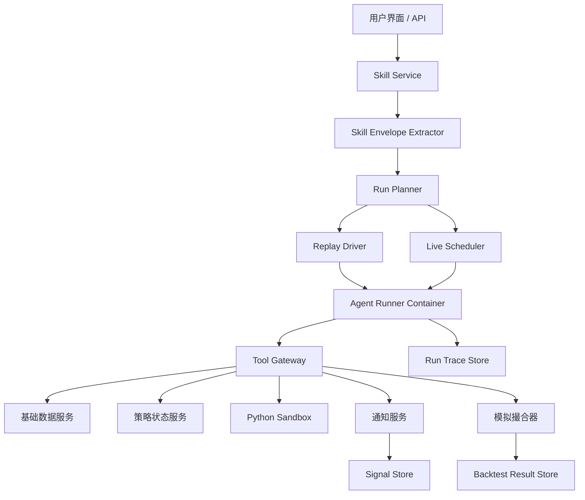

# Agent Runtime 架构设计（V0.1 建议稿）

> 历史说明（请以代码为准）
> - 本文保留的是早期 Agent Runtime 技术选型建议稿，当前代码实现已经收敛到另一条更具体的路线。
> - 当前 Runner 位于 `services/agent-runner/runner/`，通过 FastAPI 暴露执行接口，并使用 OpenAI Responses API 工具循环、HTTP Tool Gateway 回调和结构化决策清洗。
> - 文中提到的 PydanticAI、独立容器级编排、通知通道等内容不应视为当前实现状态。

## 1. 定位

这份文档定义的是“Skill 驱动的交易 Agent Runtime”。

这里的核心不是交易平台，而是：
- 一份自然语言 Skill
- 一个可以带着 Skill 与工具执行的 Agent
- 一个能在回测或实时模式中触发该 Agent 的运行底座

也就是说，交易只是业务场景；Agent Runtime 才是系统内核。

## 2. 核心目标

Agent Runtime 需要同时支持：
- 短生命周期的历史回测 Agent
- 周期触发的实时信号 Agent

并满足以下约束：
- Agent 每次运行都可调用 LLM 重新思考
- Agent 可以使用基础服务提供的市场数据和状态工具
- Agent 可以在受限沙箱内执行临时 Python 脚本
- Agent 自身不持久化长期状态
- 所有长期状态由基础服务统一保存

## 3. 推荐技术路线

按你当前 Demo 目标，我推荐：
- Agent 内核：PydanticAI
- HTTP 服务层：FastAPI
- 调度层：APScheduler 或 Prefect
- 容器运行：Docker
- 数据与状态工具：由你的基础服务通过 Tool Gateway 暴露
- 历史重放：自定义 Replay Driver
- 通知：Webhook / Telegram

推荐理由：
- PydanticAI 很适合“工具调用 + 结构化输出 + 轻量 Demo”
- APScheduler 足够简单，适合本地或单机 Demo
- Docker 易于做一次 run 一个容器的隔离模型

## 4. 顶层组件



## 5. 组件说明

## 5.1 Skill Service
职责：
- 存原始 Markdown Skill
- 保存 Skill 版本
- 返回 Skill 正文给运行系统

不负责：
- 直接做交易判断
- 直接做调度

## 5.2 Skill Envelope Extractor
职责：
- 从 Raw Skill 抽取运行契约
- 识别节奏、模式、工具需求、输出 schema、硬风控
- 生成 Skill Envelope

这是平台从“文本策略”过渡到“可运行策略”的第一步。

## 5.3 Run Planner
职责：
- 根据运行模式决定如何启动任务
- 回测模式：交给 Replay Driver
- 实时模式：交给 Scheduler
- 创建 run id、挂载 Skill 版本、绑定工具集合

## 5.4 Agent Runner Container
职责：
- 在容器中运行单次 Agent 执行
- 载入 Skill、Envelope、Runtime Context、工具列表
- 调用 LLM 推理
- 产出结构化决策
- 写入 trace

这个组件是整个系统的核心执行体。

建议设计原则：
- 一个 run 一个容器
- 容器只处理本次任务
- 完成后退出

## 5.5 Tool Gateway
职责：
- 把基础服务封装成 Agent 可调用的函数工具
- 统一参数格式
- 统一权限控制
- 统一做审计日志

我建议所有 Agent 工具都不要直接连底层服务，而是先走 Gateway。

## 5.6 Python Sandbox
职责：
- 允许 Agent 动态生成辅助分析脚本
- 计算复杂指标、过滤逻辑、数据聚合
- 运行在安全限制内

限制建议：
- 禁止网络访问
- 限制 CPU 与内存
- 限制执行时长
- 限制磁盘写入

## 5.7 Replay Driver
职责：
- 回测模式下推进模拟时间
- 按 Skill cadence 逐步触发 Agent
- 确保 Agent 在时点 T 只能看到 T 之前的数据

Replay Driver 是回测可信性的核心，而不是 Agent 自己。

## 5.8 Live Scheduler
职责：
- 根据 Skill Envelope 中的触发周期触发 Live Run
- 到点创建一个短生命周期 Agent 容器
- 不要求容器内自己跑 cron

我的建议：
- 尽量不要做“容器内自建 cron”
- 用平台调度器更稳、更简洁、更易观测

## 5.9 Sim Executor
职责：
- 仅在回测模式存在
- 接收 Agent 决策
- 做模拟下单、撮合、持仓更新、盈亏计算

注意：
- Agent 负责决策
- Sim Executor 负责模拟执行
- 二者职责必须分开

## 5.10 Result / Signal Store
职责：
- 存回测结果
- 存实时信号
- 存 run trace、reasoning summary、工具调用轨迹

## 6. 统一运行单元：Run

不管是回测还是实时，都建议统一为 `Run`。

### 6.1 Run 的共同属性
- `run_id`
- `skill_version_id`
- `mode` (`backtest` / `live_signal`)
- `trigger_time`
- `toolset`
- `runtime_context`
- `trace_sink`

### 6.2 Run 的差异
- 回测：有 `as_of_time` 与模拟账户
- 实时：有实时窗口与通知输出

统一建模的好处：
- 平台日志和调试模型一致
- 工具调用协议一致
- 未来容易加更多模式

## 7. Agent Runner 的输入输出

## 7.1 输入
Agent 每次运行时，建议输入包含：
- 原始 Skill 正文
- Skill Envelope
- 当前模式
- 当前时间点
- 运行上下文
- 工具清单
- 输出 schema
- 平台硬风控约束

## 7.2 输出
建议统一输出结构化对象，例如：

```json
{
  "action": "open_position",
  "symbol": "DOGE-USDT-SWAP",
  "direction": "sell",
  "size_pct": 0.10,
  "reason": "Short-term overheated move with weak follow-through.",
  "stop_loss": {
    "type": "price_pct",
    "value": 0.02
  },
  "take_profit": {
    "type": "price_pct",
    "value": 0.10
  },
  "state_patch": {
    "selected_symbol": "DOGE-USDT-SWAP"
  }
}
```

补充说明：
- 回测模式会用它驱动 Sim Executor
- 实时模式会用它生成通知消息

## 8. 状态管理设计

你已经明确要求：
- Agent 自己不长期记忆
- 状态由基础服务保存

所以建议状态设计为：
- Agent 每次运行前：调用 `get_strategy_state(skill_id)`
- Agent 每次运行后：调用 `save_strategy_state(skill_id, patch)`

状态里可以存：
- 当前观察标的
- 当前持仓摘要
- 上次触发时间
- 上次已发送的信号
- 防重复通知标记

这样可以实现“Agent 无状态，系统有状态”。

## 9. 工具层设计原则

## 9.1 工具必须是时点安全的
尤其回测模式，工具必须支持时间约束参数：
- `as_of`
- `end_time`

否则 Agent 可能读到未来数据。

## 9.2 工具必须是业务语义化的
建议提供：
- `scan_market`
- `get_candles`
- `get_funding_rate`
- `get_open_interest`
- `get_strategy_state`
- `save_strategy_state`
- `simulate_order`
- `emit_signal`
- `python_exec`

而不是只给一个很底层的通用数据库查询接口。

## 9.3 工具调用必须留痕
每次 run 都建议记录：
- 调用了哪些工具
- 工具输入参数
- 返回摘要
- 是否报错

## 10. 平台硬风控

虽然 Skill 中有风控描述，但平台必须还有自己的硬约束。

建议平台在 Agent 输出后再做一次校验：
- 仓位是否超平台上限
- 是否设置止损
- 是否超过最大并发仓位
- 是否超过日内回撤阈值
- 是否是允许的市场与标的

若不满足，平台可以：
- 回测模式：记录 rejection event
- 实时模式：拒绝发出该信号，并向用户/日志说明原因

## 11. 为什么推荐短生命周期容器

对于你的 Demo，我更推荐：
- 回测：一个 backtest run 一个容器
- 实时：每次调度一个 live tick 一个容器

不推荐首版做：
- 一个常驻 Agent 进程自己在容器里跑 cron

原因：
- 更稳
- 更易重试
- 更易观测
- 更易回收
- 更适合 Agent 自身无状态的模型

如果以后真的要常驻，也可以在这个架构上演进，不需要推翻。

## 12. 推荐的开源底座

### 首选：PydanticAI
适合原因：
- 工具调用友好
- 结构化输出友好
- 轻量，适合 Demo
- 便于和 FastAPI / Docker / APScheduler 组合

### 备选：LangGraph
适合原因：
- 如果未来你想做更重的工作流编排、持久化 checkpoint、恢复执行
- 更像 Agent Server，而不是单次 Runner

### 不建议作为当前主底座的方向
- 传统量化交易平台作为核心执行底座

原因不是它们没价值，而是它们和你当前“自然语言 Skill + LLM 动态判断”的中心模型不匹配。

## 13. 我对 Agent Runtime 的结论

你现在最适合搭的是：
- Skill 驱动
- Agent 为中心
- 工具外置
- 状态外置
- 回测/实时双模式统一运行时

这套架构对 Demo 最友好，也最贴合你真正想验证的产品意图。
