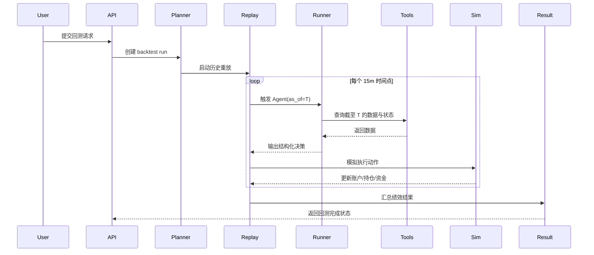
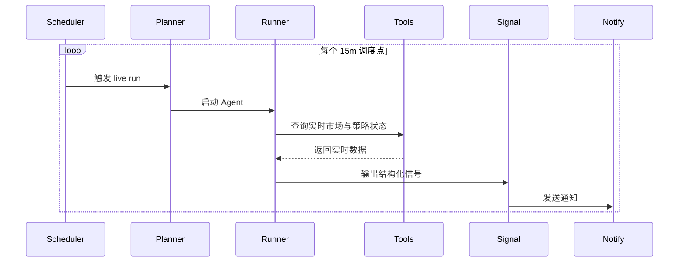

# Backtest / Live 执行上下文工作流设计（V0.1 建议稿）

> 历史说明（请以代码为准）
> - 本文保留的是早期双模式工作流草案，部分描述已经过时。
> - 当前 backtest 由 API 进程内的后台任务执行，live 由 APScheduler 触发短生命周期运行；两者都通过 Tool Gateway 访问市场、状态和组合数据。
> - 当前 live 模式使用本地历史库中的最新可用快照作为 demo 运行上下文，并把结果存成 `live_signals` 记录；通知分发不是当前已落地能力。

## 1. 定位

这份文档描述同一份 Skill 在两种执行上下文下如何运行：
- `backtest`：历史数据重放
- `live_signal`：实时周期触发

核心原则是：
- 一份 Skill
- 一套 Agent Runtime
- 两种输入源
- 两种输出消费方式

也就是说，这不是两个完全不同的系统，而是同一个运行框架的两种执行上下文。

## 2. 两种执行上下文的本质区别

### 2.1 Backtest
本质是：
- 平台人为推进时间
- 用历史数据重放环境
- 让 Agent 在每个历史时点做判断
- 再通过模拟撮合器执行动作

### 2.2 Live Signal
本质是：
- 平台按真实时间周期触发
- 用实时工具查询当前市场
- 让 Agent 输出结构化信号
- 再通过通知系统发给用户

## 3. 两种模式的共同部分

共同输入：
- Raw Skill
- Skill Envelope
- 当前模式
- 触发时间点
- 工具集合
- 平台硬风控
- 外部状态快照

共同输出：
- 结构化决策
- reasoning trace
- 工具调用轨迹
- 状态更新 patch

## 4. Backtest 模式工作流

## 4.1 概览



## 4.2 详细步骤

### 第一步：提交回测请求
用户提交：
- `skill_version_id`
- 历史时间范围
- 初始资金
- 可选参数

平台做校验：
- Skill 是否已通过验证并具备可执行 cadence
- Skill Envelope 是否存在
- 历史数据是否覆盖该区间
- 所需工具是否可用

### 第二步：创建 Backtest Run
平台创建：
- `backtest_run`
- `run_manifest`
- 初始模拟账户
- 初始外部状态快照

### 第三步：启动 Replay Driver
Replay Driver 负责：
- 读取 Skill cadence，例如 `15m`
- 在区间内生成触发点序列
- 例如：`T0, T0+15m, T0+30m, ...`

### 第四步：在每个时间点触发 Agent
在时间点 `T`：
- 启动一次 Agent 执行
- 告诉它当前是 backtest 模式
- 告诉它当前模拟时间为 `T`

Agent 只能通过工具看到：
- `<= T` 的历史数据
- 不能看到未来任何数据

### 第五步：Agent 调工具与推理
常见工具调用包括：
- `scan_market(as_of=T)`
- `get_candles(symbol, timeframe, end_time=T)`
- `get_funding_rate(symbol, as_of=T)`
- `get_strategy_state(skill_id, as_of=T)`
- `python_exec(...)`

然后输出结构化决策。

### 第六步：模拟撮合器执行
若输出是交易动作，则 Sim Executor：
- 校验平台风控
- 按模拟成交模型执行
- 更新持仓、资金、浮盈亏、已实现盈亏
- 写入 ledger

### 第七步：保存 trace
每个时间点建议至少保存：
- 当前模拟时间
- Agent 摘要理由
- 工具调用列表
- 最终决策
- 模拟成交结果
- 模拟账户快照

### 第八步：汇总结果
回测结束后输出：
- 收益曲线
- 最大回撤
- 胜率
- 信号次数
- 交易记录
- 关键 reasoning sample

## 5. Live 模式工作流

## 5.1 概览



## 5.2 详细步骤

### 第一步：注册 Live Skill
当用户启用实时运行后，平台根据 Skill Envelope：
- 识别 cadence
- 注册调度任务
- 记录该 Skill 当前为 `active`

### 第二步：按周期触发
到达周期点，比如每 `15m`：
- 平台调度器创建一个 `live_run`
- 启动一个短生命周期 Agent 容器

### 第三步：读取实时上下文
Agent 调用工具读取：
- 当前市场扫描结果
- 目标标的行情
- 资金费率
- 持仓量
- 外部状态快照

### 第四步：输出结构化信号
例如：
- `skip`
- `watch`
- `open_position`
- `close_position`
- `reduce_position`
- `hold`

### 第五步：平台消费输出
实时模式下，目前只做通知，不做真实下单。

所以平台会：
- 生成人类可读通知
- 保存结构化信号
- 写回状态 patch

### 第六步：退出容器
任务结束后容器退出。

## 6. 为什么推荐“调度器触发短任务”，而不是“容器内常驻 cron”

虽然你说两种都可以，但从健壮性和简洁性上，我更推荐平台调度器触发短任务。

原因：
- 调度统一在平台侧，便于观察与控制
- 容器崩了不会丢整个长期任务
- 更适合 Agent 本身无状态
- 更容易做重试
- 更容易回收资源

如果未来真的要在容器里做常驻 cron，也可以演进，但 Demo 阶段没必要。

## 7. 两种模式的输入差异

| 维度 | Backtest | Live Signal |
|---|---|---|
| 时间 | 平台模拟推进 | 真实当前时间 |
| 数据来源 | 历史数据仓 | 实时 API + 当前状态 |
| 输出用途 | 模拟成交 | 发送信号 |
| 账户状态 | 模拟账户 | 外部状态快照 |
| 未来数据 | 严格禁止 | 不存在这个问题 |

## 8. 两种模式的输出差异

### Backtest 输出
- 交易动作
- 模拟成交结果
- 盈亏变化
- 回测 summary
- trace

### Live 输出
- 结构化信号
- 人类可读通知
- 状态 patch
- trace

## 9. 决策结构建议

建议统一输出 schema：

```json
{
  "action": "open_position",
  "symbol": "DOGE-USDT-SWAP",
  "direction": "sell",
  "size_pct": 0.10,
  "confidence": 0.78,
  "reason": "Short-term overextension with weak continuation probability.",
  "stop_loss": {
    "type": "price_pct",
    "value": 0.02
  },
  "take_profit": {
    "type": "price_pct",
    "value": 0.10
  },
  "state_patch": {
    "focus_symbol": "DOGE-USDT-SWAP"
  }
}
```

## 10. 未来数据隔离原则（Backtest 必须遵守）

这是回测模式里最重要的原则。

### 平台必须保证
- `scan_market(as_of=T)` 只返回时点 T 可见市场信息
- `get_candles(end_time=T)` 不能返回 T 之后的 K 线
- `get_funding_rate(as_of=T)` 不能返回未来 funding 数据
- `get_strategy_state(as_of=T)` 只能返回在 T 时刻之前已保存的状态

如果做不到这一点，回测结果会被未来信息污染。

## 11. 非强可复现的影响

你已经明确说明：
- 同一 Skill、同一数据，重复跑不要求完全一致

这意味着：
- 回测结果更接近“Agent 策略评估”
- 而不是传统量化那种强确定性回测

因此平台应重点保存：
- 决策过程摘要
- 工具调用轨迹
- 模型版本
- Skill 版本
- 运行时间点

而不应假设回测结果必须逐笔完全一致。

## 12. 建议保存的 Trace 内容

每个触发点建议保存：
- `run_id`
- `step_index`
- `mode`
- `trigger_time`
- `tool_calls`
- `agent_summary`
- `structured_output`
- `risk_checks`
- `execution_result`

这样即使回测不是强确定性的，也能让你解释“为什么 Agent 当时这么判断”。

## 13. Demo 阶段建议先支持的能力

### 13.1 Backtest
- 单 Skill 单回测任务
- 单账户模拟
- 单次容器执行
- 15m / 4h 节奏支持
- 结构化交易输出
- 收益结果汇总

### 13.2 Live
- 单 Skill 激活
- 平台调度器每周期拉起一次 Agent
- 结构化信号通知
- 状态外置存储

## 14. 我对双模式工作流的结论

最适合你的不是“两个不同系统”，而是一套统一 Runtime：
- Backtest = 历史重放驱动的 Agent
- Live = 实时调度驱动的 Agent

只要这个统一框架搭起来，你后续无论加：
- 更多数据工具
- 更丰富通知渠道
- 更复杂状态管理
- 更多策略类型

都不需要推翻当前模式。
