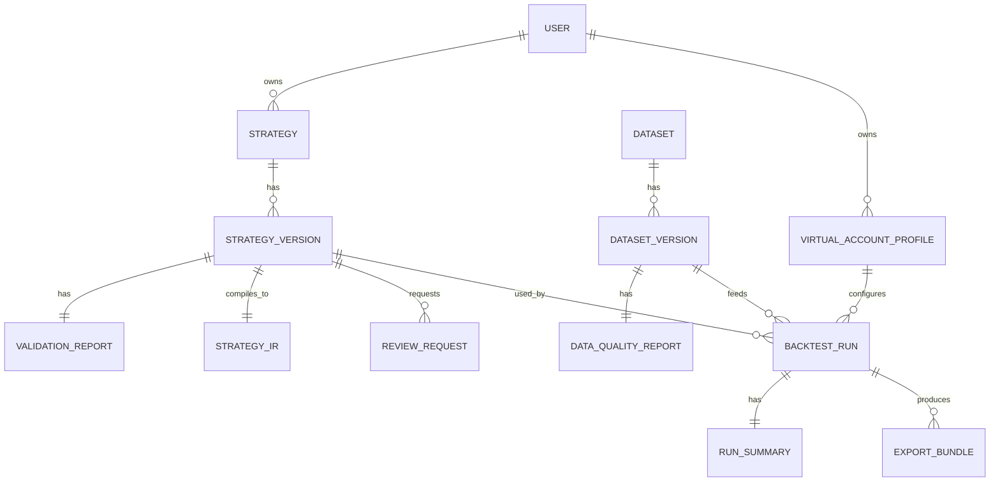

# 数据库实体设计（V0.1 建议稿）

> 历史说明（请以代码为准）
> - 本文保留的是早期数据模型方案，不代表当前 SQLite demo 的实际表结构。
> - 当前模型定义以 `apps/api/app/models.py` 为准，核心对象是 `Skill`、`BacktestRun`、`RunTrace`、`LiveTask`、`LiveSignal`、`ExecutionStrategyState`、`PortfolioBook` / `PortfolioPosition` / `PortfolioFill`、`TraceExecutionDetail`、`MarketCandle`、`CsvIngestionJob`、`MarketSyncCursor`。
> - `skills.review_status` 和 `strategy_states` 仍以遗留字段/表的形式存在，但当前运行路径使用的是执行域状态 `execution_strategy_states`，并没有 `strategy_version`、`review_request`、`export_bundle`、`run_manifest` 这些当前资源。

## 1. 目标

这份文档定义首版 Agent 交易 Skills 平台的核心数据实体，用来支撑：
- 文本 skill 的版本化管理
- 自动校验与人工审核流程
- 历史数据快照管理
- 回测任务与结果存储
- 后续向多标的、多策略、更多市场扩展

首版建议：
- 关系型元数据使用 PostgreSQL
- 大体量时序或明细数据使用对象存储 + Parquet

也就是说：
- 数据库负责“谁、什么版本、什么状态、什么配置、什么结果摘要”
- 对象存储负责“大量明细流水和导出产物”

## 2. 顶层实体关系

## 3. PostgreSQL 中建议落表的实体

## 3.1 用户与权限

### `users`
用途：平台用户。

关键字段建议：
- `id`
- `email`
- `display_name`
- `status`
- `created_at`
- `updated_at`

### `user_roles`
用途：用户角色映射。

关键字段建议：
- `id`
- `user_id`
- `role` (`author` / `reviewer` / `operator` / `admin`)
- `created_at`

## 3.2 Strategy 相关

### `strategies`
用途：逻辑策略对象，是多个版本的父级容器。

关键字段建议：
- `id`
- `owner_user_id`
- `name`
- `description`
- `market_profile`
- `archived_at`
- `created_at`
- `updated_at`

约束建议：
- `(owner_user_id, name)` 可唯一，防止同一用户重复创建同名逻辑策略

### `strategy_versions`
用途：用户每次提交文本 skill 形成的不可变版本。

关键字段建议：
- `id`
- `strategy_id`
- `version_label`，例如 `1.0.0`
- `status` (`pending_validation` / `validation_failed` / `preview_ready` / `review_pending` / `approved_full_window` / `review_rejected`)
- `source_text`
- `source_hash`
- `parser_version`
- `market_profile`
- `timeframe`
- `position_mode`
- `warmup_bars`
- `primary_symbol`
- `preview_window_start`
- `preview_window_end`
- `approved_window_start`
- `approved_window_end`
- `change_note`
- `preview_eligible`，布尔值
- `created_by_user_id`
- `created_at`

约束建议：
- `(strategy_id, version_label)` 唯一
- `source_hash` 不要求全局唯一，但建议可索引

设计说明：
- preview 与 approved window 放在版本表里，是因为它们本质上属于“版本当前权限边界”
- 如果未来审批粒度更复杂，再拆授权表

### `validation_reports`
用途：存储自动校验结果。

关键字段建议：
- `id`
- `strategy_version_id`
- `status` (`passed` / `failed` / `warning_only`)
- `errors_json`
- `warnings_json`
- `notes_json`
- `normalized_metadata_json`
- `created_at`

约束建议：
- 首版可对 `strategy_version_id` 做 1:1
- 如果未来支持多次重新校验，可变成 1:N，并加 `report_version`

### `strategy_irs`
用途：存储编译后的 Strategy IR 元数据与对象存储引用。

关键字段建议：
- `id`
- `strategy_version_id`
- `schema_version`
- `parser_version`
- `storage_uri`
- `content_hash`
- `created_at`

说明：
- 大 JSON 可以直接放数据库，也可以只存 `storage_uri`
- 首版如果 IR 不大，直接 JSONB 存 PostgreSQL 也可行
- 若预期后续复杂度会上升，我更建议 `JSONB + storage_uri` 双保留策略

## 3.3 审核相关

### `review_requests`
用途：记录用户申请 full-history 的审核请求。

关键字段建议：
- `id`
- `strategy_version_id`
- `requested_by_user_id`
- `status` (`pending` / `approved` / `rejected` / `cancelled`)
- `requested_window_start`
- `requested_window_end`
- `reason`
- `reviewed_by_user_id`
- `review_comment`
- `reviewed_at`
- `created_at`

约束建议：
- 同一 `strategy_version_id` 同时最多只能有 1 个 `pending` 请求

我的建议：
- 审核拒绝后，`strategy_version.status` 设为 `review_rejected`
- 同时保留 `preview_eligible = true`
- 不要因为 full-history 被拒绝，就剥夺 preview 权限

## 3.4 历史数据相关

### `datasets`
用途：逻辑数据集，例如某个市场或交易所的数据集合。

关键字段建议：
- `id`
- `name`
- `market_profile`
- `description`
- `created_at`

### `dataset_versions`
用途：某个历史数据集的不可变版本。

关键字段建议：
- `id`
- `dataset_id`
- `version_label`
- `status` (`ingesting` / `ready` / `degraded` / `rejected` / `deprecated`)
- `exchange`
- `symbol`
- `timeframe`
- `timezone`
- `quote_asset`
- `coverage_start`
- `coverage_end`
- `storage_uri`
- `row_count`
- `created_at`
- `published_at`

约束建议：
- `(dataset_id, version_label)` 唯一

### `data_quality_reports`
用途：数据质量报告。

关键字段建议：
- `id`
- `dataset_version_id`
- `status` (`passed` / `warning` / `failed`)
- `missing_interval_count`
- `duplicate_row_count`
- `precision_mismatch_count`
- `warnings_json`
- `errors_json`
- `created_at`

## 3.5 虚拟账户相关

### `virtual_account_profiles`
用途：用户可复用的虚拟账户配置模板。

关键字段建议：
- `id`
- `owner_user_id`
- `name`
- `base_currency`
- `initial_equity`
- `fee_profile_json`
- `slippage_profile_json`
- `risk_overrides_json`
- `created_at`
- `updated_at`

说明：
- 配置模板允许修改
- 但 run 创建后应把快照固化进 `run_manifest`

## 3.6 回测运行相关

### `backtest_runs`
用途：一次异步回测任务。

关键字段建议：
- `id`
- `owner_user_id`
- `strategy_version_id`
- `strategy_ir_id`
- `dataset_version_id`
- `virtual_account_profile_id`
- `status` (`queued` / `running` / `completed` / `failed` / `cancelled`)
- `scope` (`preview` / `approved_full_history`)
- `requested_window_start`
- `requested_window_end`
- `manifest_json`
- `benchmark_policy`
- `benchmark_config_json`
- `parameter_overrides_json`
- `failure_code`
- `failure_message`
- `queued_at`
- `started_at`
- `completed_at`
- `cancelled_at`
- `created_at`

说明：
- `manifest_json` 很关键，它是回测可复现的锚点
- 即使虚拟账户配置后来改了，历史 run 也不受影响

### `run_summaries`
用途：存储回测摘要指标。

关键字段建议：
- `id`
- `backtest_run_id`
- `net_pnl`
- `total_return_pct`
- `benchmark_return_pct`
- `excess_return_pct`
- `max_drawdown_pct`
- `trade_count`
- `win_rate_pct`
- `fees_paid`
- `trust_warnings_json`
- `computed_at`

约束建议：
- 首版 1:1 绑定 `backtest_run_id`

### `export_bundles`
用途：导出任务与产物记录。

关键字段建议：
- `id`
- `backtest_run_id`
- `status` (`queued` / `generating` / `ready` / `failed`)
- `format`
- `include_json`
- `storage_uri`
- `created_at`
- `completed_at`

## 4. 建议放对象存储的内容

以下内容不建议全部塞 PostgreSQL：
- 原始历史 bar 数据
- 大体量 event ledger
- order ledger 明细全集
- fill ledger 明细全集
- equity curve 全量时间序列
- export bundle 文件

建议组织方式：
- S3 / MinIO + Parquet
- 路径包含 `dataset_version_id`、`backtest_run_id`、`artifact_type`

示例：
- `s3://bucket/datasets/dv_456/bars.parquet`
- `s3://bucket/runs/run_123/orders.parquet`
- `s3://bucket/runs/run_123/fills.parquet`
- `s3://bucket/runs/run_123/equity_curve.parquet`

## 5. 一个关键设计：为什么需要 `strategy` 和 `strategy_version` 分离

因为它们承载的是不同语义：
- `strategy` 代表“这是一套策略”
- `strategy_version` 代表“这套策略在某个时刻提交的不可变文本版本”

如果不分离，会出现几个问题：
- 用户改一点点文本就覆盖旧策略，历史结果难追踪
- 很难比较 `1.0.0` 和 `1.0.1` 的效果差异
- 审核记录与回测记录会混乱

所以我建议一定要分开。

## 6. 一个关键设计：为什么 `manifest_json` 必须落表

因为回测结果可信不可信，核心在于能否回答：
- 用的是哪一版 strategy
- 用的是哪一版 IR
- 用的是哪一版数据
- 用的是哪套参数
- 用的是哪套 fee/slippage/benchmark 配置

这些信息如果只靠外键实时回查，会在后续配置变化时失真。

所以建议：
- 外键保留引用关系
- `manifest_json` 保留运行时快照

## 7. 我建议的索引重点

### 高频查询索引
- `strategy_versions(strategy_id, created_at desc)`
- `strategy_versions(status)`
- `review_requests(status, created_at)`
- `dataset_versions(status, coverage_start, coverage_end)`
- `backtest_runs(owner_user_id, created_at desc)`
- `backtest_runs(strategy_version_id, created_at desc)`
- `backtest_runs(status, queued_at)`

### 审核运营索引
- `review_requests(status, requested_window_start)`
- `dataset_versions(exchange, symbol, timeframe, status)`

## 8. 后续扩展位

这套模型已经给未来留了扩展口：
- 多标的：扩展 `strategy_version` 与 `dataset_version` 的 symbol 范围
- 多策略组合：新增 `portfolio` 与 `portfolio_members`
- 更复杂审批：新增 `strategy_permissions` 授权表
- 实盘化：新增 `execution_account`、`live_signal`、`broker_order`

## 9. 我对数据模型的结论

首版最重要的是把 4 件事建模正确：
- 文本策略版本
- 编译后的 IR
- 不可变 run manifest
- 数据快照版本

只要这 4 件事建对了，平台后面怎么扩功能，成本都会低很多。
