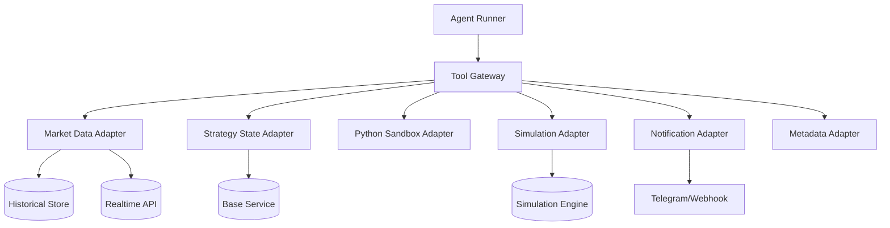

# Tool Gateway 设计文档（V0.1 建议稿）

## 1. 定位

Tool Gateway 是 Agent Runtime 和你的基础服务之间的中间层。

它的职责不是存数据，也不是做交易判断，而是：
- 把你的基础服务能力封装成 Agent 可调用的工具
- 对工具调用做统一的参数规范、权限控制、审计日志和时点约束
- 让同一套工具既能被回测模式使用，也能被实时模式使用

一句话理解：
- Agent 不直接访问底层服务
- Agent 只访问 Tool Gateway 暴露的高层业务工具

## 2. 为什么必须有 Tool Gateway

如果让 Agent 直接访问底层数据库或实时 API，会出现几个问题：
- 工具粒度太低，Agent 难以稳定使用
- 回测模式容易读到未来数据
- 实时模式与回测模式接口不一致
- 无法统一审计 Agent 的工具调用行为
- 后面替换数据源或状态服务时，Agent Prompt 会被迫变化

所以 Tool Gateway 的核心价值是：
- 对 Agent 暴露稳定语义
- 对平台隐藏底层实现变化

## 3. 设计原则

### 3.1 工具必须是业务语义化的
不要直接给 Agent：
- SQL 查询接口
- 任意 HTTP 请求能力
- 任意文件系统遍历能力

应该给 Agent：
- `scan_market`
- `get_candles`
- `get_strategy_state`
- `emit_signal`

### 3.2 工具必须区分 backtest / live 上下文
同样的工具名，在不同模式里应由不同适配器实现。

例如：
- `get_candles` 在 backtest 模式读历史仓
- `get_candles` 在 live 模式调实时服务

但对 Agent 来说，接口可以保持一致。

### 3.3 工具必须有时点安全
尤其回测模式：
- 所有市场类工具都必须支持 `as_of` 或 `end_time`
- Gateway 必须保证 Agent 不会读到未来数据

### 3.4 工具必须留痕
每次调用应至少记录：
- `run_id`
- `tool_name`
- 输入参数摘要
- 返回摘要
- 调用时间
- 是否成功

### 3.5 工具必须有资源限制
尤其是 Python 执行类工具：
- 限 CPU
- 限内存
- 限执行时长
- 禁止网络访问
- 限制磁盘写入

## 4. 顶层结构



## 5. 工具分类

建议把工具按 6 类管理。

## 5.1 市场扫描类
用于帮助 Agent 发现候选标的。

### `scan_market`
用途：扫描当前市场，返回满足条件的标的候选集。

建议输入：

```json
{
  "as_of": "2026-04-13T12:00:00Z",
  "instrument_type": "swap",
  "quote_asset": "USDT",
  "limit": 50,
  "filters": {
    "min_24h_volume_usd": 5000000
  }
}
```

建议输出：

```json
{
  "items": [
    {
      "symbol": "DOGE-USDT-SWAP",
      "last_price": 0.21,
      "change_24h_pct": 0.23,
      "volume_24h_usd": 120000000,
      "funding_rate": 0.0012,
      "open_interest_change_24h_pct": 0.18
    }
  ]
}
```

说明：
- 这就是“山寨币由 Agent 自己理解”的基础
- Gateway 不定义“山寨币”，只给足够的市场扫描信息

## 5.2 行情与指标原料类

### `get_candles`
用途：获取某个标的某个周期的 K 线。

建议输入：

```json
{
  "symbol": "DOGE-USDT-SWAP",
  "timeframe": "15m",
  "end_time": "2026-04-13T12:00:00Z",
  "limit": 200
}
```

建议输出：
- 标准 OHLCV 列表

### `get_funding_rate`
用途：获取某标的 funding 数据。

### `get_open_interest`
用途：获取某标的持仓量相关数据。

### `get_market_metadata`
用途：获取交易规则和标的信息。

建议字段：
- `tick_size`
- `lot_size`
- `min_order_size`
- `instrument_type`
- `quote_asset`

## 5.3 状态类

### `get_strategy_state`
用途：读取某 Skill 当前状态。

建议输入：

```json
{
  "skill_id": "skill_123",
  "mode": "live_signal"
}
```

建议输出：

```json
{
  "state": {
    "focus_symbol": "DOGE-USDT-SWAP",
    "last_signal_at": "2026-04-13T08:00:00Z",
    "last_action": "watch"
  }
}
```

### `save_strategy_state`
用途：写回状态 patch。

建议输入：

```json
{
  "skill_id": "skill_123",
  "patch": {
    "focus_symbol": "WIF-USDT-SWAP",
    "last_signal_at": "2026-04-13T12:00:00Z"
  }
}
```

说明：
- 我建议用 patch 风格，而不是每次整对象覆盖
- 更适合 Agent 输出最小改动

## 5.4 模拟执行类

### `simulate_order`
用途：回测模式下提交一个模拟订单。

建议输入：

```json
{
  "run_id": "bt_123",
  "symbol": "DOGE-USDT-SWAP",
  "direction": "sell",
  "size_pct": 0.10,
  "order_type": "market",
  "as_of": "2026-04-13T12:00:00Z",
  "stop_loss": {
    "type": "price_pct",
    "value": 0.02
  },
  "take_profit": {
    "type": "price_pct",
    "value": 0.10
  }
}
```

### `get_sim_portfolio`
用途：获取回测模式当前模拟账户快照。

建议输出：
- 可用资金
- 当前持仓
- 已实现盈亏
- 未实现盈亏
- 净值

## 5.5 通知类

### `emit_signal`
用途：实时模式下输出信号并通知用户。

建议输入：

```json
{
  "skill_id": "skill_123",
  "signal": {
    "action": "open_position",
    "symbol": "DOGE-USDT-SWAP",
    "direction": "sell",
    "size_pct": 0.10,
    "reason": "Short-term overextension detected.",
    "stop_loss": {
      "type": "price_pct",
      "value": 0.02
    },
    "take_profit": {
      "type": "price_pct",
      "value": 0.10
    }
  },
  "channels": ["telegram"]
}
```

说明：
- 首版建议支持 `telegram` 或 `webhook` 即可

## 5.6 计算类

### `python_exec`
用途：允许 Agent 生成辅助计算脚本。

建议输入：

```json
{
  "code": "import pandas as pd\n# calc indicators ...",
  "input_refs": {
    "candles": "tmp://candles/DOGE-15m-001"
  },
  "timeout_sec": 10
}
```

建议输出：
- stdout 摘要
- 结构化结果 JSON
- 错误信息

特别说明：
- 这个工具只做辅助分析，不做任意系统管理
- 禁止直接联网
- 禁止访问未授权路径

## 6. 统一工具接口协议

建议所有工具统一返回如下结构：

```json
{
  "ok": true,
  "data": {},
  "meta": {
    "tool": "get_candles",
    "latency_ms": 31
  },
  "error": null
}
```

失败时：

```json
{
  "ok": false,
  "data": null,
  "meta": {
    "tool": "get_candles",
    "latency_ms": 31
  },
  "error": {
    "code": "symbol_not_found",
    "message": "Unknown symbol DOGE-USDT-SWAP"
  }
}
```

好处：
- Agent 对返回格式的理解更稳定
- 日志结构统一
- Tool Gateway 更易调试

## 7. Backtest / Live 适配策略

推荐设计：
- Agent 看见的是统一工具名
- Gateway 在内部根据 `mode` 分发到不同 adapter

例如：

```text
get_candles()
  -> backtest: HistoricalCandleAdapter
  -> live: RealtimeCandleAdapter
```

这样有两个好处：
- Prompt 不需要区分两套工具名
- 两种模式的 Skill 可最大程度共用

## 8. 调用日志与审计

每次工具调用建议记录：
- `run_id`
- `mode`
- `tool_name`
- `input_hash`
- `response_summary`
- `success`
- `latency_ms`
- `created_at`

在 Demo 阶段至少要保存：
- 最近 N 次 run 的工具调用轨迹
- 失败调用列表

## 9. 安全与限制

### 9.1 不建议暴露给 Agent 的能力
- 任意 shell
- 任意网络访问
- 任意数据库查询
- 任意文件系统写入
- 任意 HTTP 请求

### 9.2 必须限制的能力
- Python 脚本执行时间
- 单次工具调用返回大小
- scan_market 返回条数
- 历史 K 线最大 limit

## 10. 示例：与你当前需求最小对齐的工具集

如果只做 Demo，建议第一版先做这 9 个工具：
- `scan_market`
- `get_candles`
- `get_funding_rate`
- `get_open_interest`
- `get_market_metadata`
- `get_strategy_state`
- `save_strategy_state`
- `simulate_order`
- `emit_signal`
- `python_exec`

这套已经够支撑：
- 历史回测
- 实时扫描
- 山寨币自解释
- 辅助指标计算
- 信号通知

## 11. 我对 Tool Gateway 的结论

对于你的系统来说，Agent 的“理解能力”最终取决于工具层，而不是 Skill 文本本身。

所以真正的系统护城河不是：
- 交易所接入数量
- 量化指标库多少

而是：
- 你是否把基础服务封装成一套稳定、时点安全、语义清晰的 Agent 工具集

Tool Gateway 就是这件事的核心。
